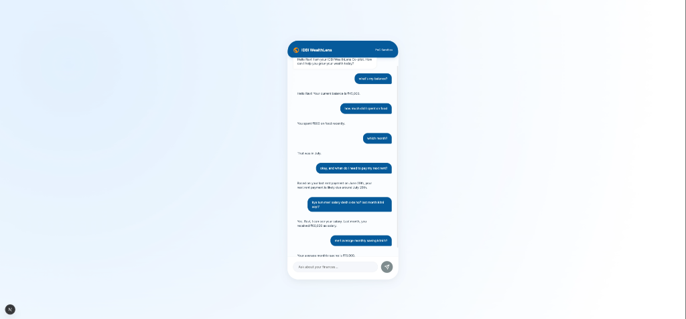
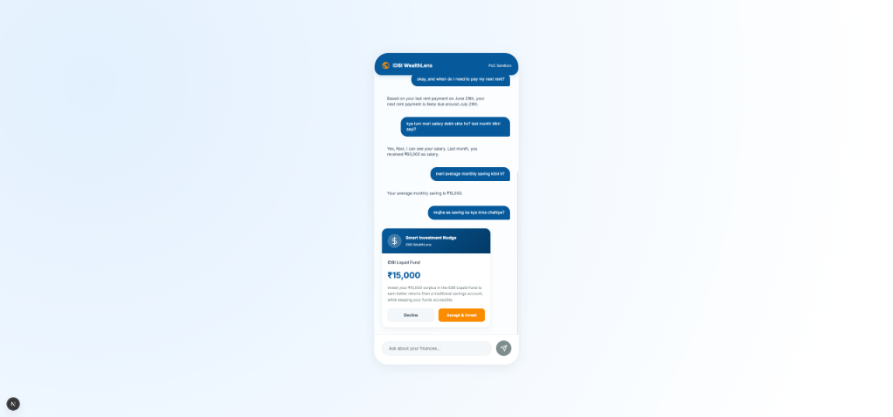
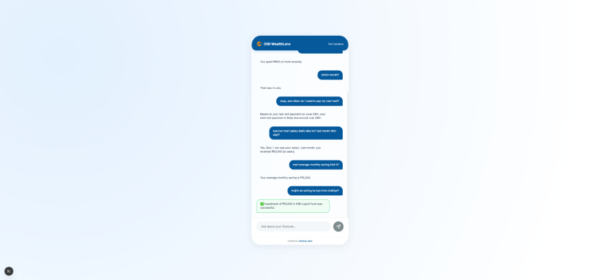

# IDBI WealthLens

An AI-assisted wealth co-pilot concept for a mobile banking experience. The Phase 1 proof of concept combines conversational financial queries, cash-flow analysis, and contextual investment nudges over mock banking data.

## What it demonstrates

- **Conversational financial interface** with intent identification.
- **Predictive cash-flow nudge** that identifies surplus cash in mock transactions.
- **Structured tool calling** to work with financial data and trigger application actions.
- **Mock sandbox integration** representing transaction and investment APIs.

## Architecture

```text
User
 ↓
Next.js UI
 ↓
Intent / reasoning layer
 ↓
Financial tools
 ├── transaction data
 ├── balance / spending analysis
 └── investment sandbox
 ↓
Contextual response or investment nudge
```

The project intentionally uses mock financial data and sandbox operations. It is a **proof of concept**, not a production banking integration.

## Screenshots

<div align="center">
  
  
  
</div>

## Demo

The repository includes a demo video at [`public/assets/idbi_wealthlens_demo.mp4`](public/assets/idbi_wealthlens_demo.mp4).

## Example questions

```text
What's my current balance?
How much did I spend on food this month?
When do I need to pay my next rent?
Do I have any surplus cash?
What should I do with my extra savings?
```

## Technology

- Next.js / App Router
- React
- Vanilla CSS
- Gemini API for intent parsing and structured tool calling

## Quick start

Requirements: Node.js and npm.

```bash
git clone https://github.com/anonyxhappie/idbiinnovate.git
cd idbiinnovate
npm install
```

Create `.env.local` and provide the required Gemini API key:

```text
GEMINI_API_KEY=your_key_here
```

Run the development server:

```bash
npm run dev
```

Open `http://localhost:3000`.

## Scope and limitations

This repository is a Phase 1 PoC. Financial data, banking APIs, and investment execution are simulated. It should not be interpreted as a production financial-advice or banking system.

## Author

Created by [Akshay Saini](https://github.com/anonyxhappie).
